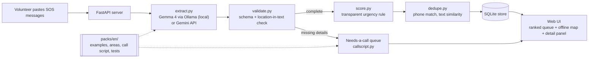

# ReliefRank

> Offline, open-source flood SOS triage: Gemma 4 reads messy rescue messages, and transparent rules rank them so volunteers know who to reach first.

## Team

**Team Name:** [Repohunterz]

| Member | Contribution |
| ------ | ------------ |
| Hemachandra | AI pipeline: Gemma 4 backends, extraction prompt, JSON parsing, location validation |
| Ramakrishnayya | Core logic: case schema, urgency scoring, duplicate merging, storage, pipeline |
| Shivaji | Interface: FastAPI server, triage queue, offline map, case detail panel |
| Radhakrishnan (Team Lead) | Demo dataset, area lookup, call scripts, evaluation, documentation, submission |

## Problem Statement

### The Problem

During floods, rescue requests reach volunteer control rooms as hundreds of unstructured messages via WhatsApp, SMS and phone transcripts. They are written in a hurry, in mixed languages, with missing or vague locations, and the same family is often reported several times by different relatives. Volunteers have to read every message by hand to decide who is most at risk, while connectivity is unreliable and the messages contain private details (names, phone numbers, medical needs).

### Why We Chose This Problem

During the 2018 Kerala floods, volunteer coordinators handled huge volumes of rescue messages manually through shared spreadsheets and chat groups. Manual reading slows down triage exactly when minutes matter. The problem also needs a model that can run locally: the data is private, and internet access fails during a flood. That makes it a real use case for an open-weight model, not just an API call.

## Solution

ReliefRank is a local web app. A volunteer pastes in a batch of messages. Gemma 4 extracts structured fields from each one (number of people, vulnerable people, trapped or not, water level, location, phone, and a one-line reason). Ordinary, inspectable code then scores urgency, merges duplicates, ranks the cases and places them on a map. Cases that are missing key details go to a "needs a call" queue with a ready-made call script.

The design principle is **AI that reads, code that decides.** The model never decides who gets help first. The ranking rule is visible and explainable.

### Key Features

- Gemma 4 extraction of structured fields from free-text SOS messages, running locally
- Transparent urgency score with a per-case breakdown of why it ranked where it did
- Duplicate detection (same phone number first, then text similarity)
- "Needs a call" queue for incomplete or unverifiable cases, with a generated call script
- Offline map of ranked cases (bundled Leaflet; no CDN required)
- Language packs: English ships; other languages are added as plug-in folders without touching core code

## Innovation and Differentiation

- **Offline and private by design.** The model runs on the volunteer's laptop through Ollama, so no message leaves the device and it keeps working without internet.
- **Separation of reading and deciding.** The LLM only extracts fields. Ranking is a deterministic rule that judges and responders can audit, which is safer than letting a model prioritise lives.
- **Hallucination guard.** A location is accepted only if it actually appears in the message text; otherwise the case is routed to a human call instead of being guessed onto the map.
- **Pluggable language packs.** Prompt examples, area names, call scripts and test messages live in `packs/<lang>/`, so a contributor can add a language without editing the pipeline.

## Technical Implementation

### Architecture



### Technology Stack

| Category        | Technologies |
| --------------- | ------------ |
| Frontend        | HTML, CSS, JavaScript, Leaflet (bundled locally) |
| Backend         | Python, FastAPI, Uvicorn, Pydantic |
| Database        | SQLite |
| AI / ML         | Gemma 4 (E4B, or E2B on slower laptops) |
| Infrastructure  | Runs locally on a laptop; Ollama for local inference |
| APIs / Services | Ollama local API; Gemini API (optional, prototyping only) |

### How It Works

1. **Input:** messages are pasted into the web page and sent to `POST /api/messages`.
2. **Extraction (`reliefrank/extract.py`):** builds a few-shot prompt from the language pack's examples and asks Gemma 4 for JSON. Invalid JSON is retried once.
3. **Validation (`reliefrank/validate.py`):** checks the schema and confirms that the extracted location appears in the original text. Cases with missing or unverified details go to the needs-a-call queue.
4. **Scoring (`reliefrank/score.py`):** adds points for trapped people, vulnerable people, rising water and people count, and records a reason for each point.
5. **Deduplication (`reliefrank/dedupe.py`):** merges cases with the same phone number, then near-identical text.
6. **Geolocation (`reliefrank/geo.py`):** maps the area name to coordinates using the pack's `areas.json`.
7. **Output:** `GET /api/cases` returns the ranked list; the page draws the queue, map pins and a detail panel with the score breakdown and original messages.

### Technical Decisions

- **Fixed pipeline, not an agent.** Predictable within a 6-hour build and explainable to responders.
- **One LLM interface (`llm/base.py`) with two backends.** Local Ollama for the real offline use case; the Gemini API only to prototype quickly.
- **Rule-based scoring.** Every rank can be explained line by line.
- **Plain HTML/JS served by FastAPI.** No build step, and the whole app starts from `run.py`.
- **All settings in `config.py`, secrets in `.env`.**

## Implementation During the Hackathon

All code in this repository was written during Hack Day on 8 October 2026. Completed during the event:

- Gemma 4 extraction with JSON retry
- Location validation and needs-a-call routing
- Urgency scoring with reasons
- Duplicate merging
- FastAPI server, ranked queue and offline map
- Call-script generation for incomplete cases
- English language pack: 20 synthetic test messages, 15 mapped areas, call-script template
- Evaluation script that measures extraction accuracy and the top-10 critical hit rate

### Evaluation

`eval/evaluate.py` runs the real pipeline on the synthetic test set and writes [eval/results.md](eval/results.md): per-field extraction accuracy and how many messages labelled critical land in the top 10.

**Future work:** Malayalam and Tamil language packs, photo input, and a follow-up assistant that asks senders for missing details with a volunteer approving every message.

### Team Contributions

- **Hemachandra:** `reliefrank/llm/`, `extract.py`, `validate.py`, `packs/en/examples.json`
- **Ramakrishnayya:** `config.py`, `run.py`, `models.py`, `score.py`, `dedupe.py`, `pipeline.py`, `store.py`, tests
- **Shivaji:** `server/api.py`, `server/static/` (queue, map, detail panel)
- **Radhakrishnan (Team Lead):** `data/demo_messages.json`, `packs/en/areas.json`, `geo.py`, `callscript.py`, `eval/evaluate.py`, README, `CONTRIBUTING.md`, submission

## Working Application

**Live Application:** N/A (runs locally by design)

ReliefRank is built to run offline on a volunteer's laptop, because flood control rooms often have no reliable internet and the messages are private. Follow **Setup and Usage** below to run it, or watch the demo video.

## Demo Video

**Demo Video:** [Video URL]

The video shows a batch of SOS messages being pasted in, the ranked queue and map filling up, a case's score breakdown, the needs-a-call queue, and the app still working with Wi-Fi turned off.

## Open Source and AI Usage

### AI / Models

- **Gemma 4 (Google DeepMind, Apache 2.0):** the only AI component. Used in `reliefrank/extract.py` to turn each free-text message into structured JSON fields. It does not rank, decide or send anything.
- **Ollama:** serves Gemma 4 locally.
- **Gemini API (optional):** serves Gemma 4 remotely during development only.

### Open Source Components

- **FastAPI / Uvicorn / Pydantic:** web server and data validation
- **Leaflet:** map rendering (bundled locally)
- **OpenStreetMap:** map tiles when online; © OpenStreetMap contributors
- **SQLite:** case storage
- **Demo dataset:** `data/demo_messages.json` contains **synthetic messages written by the team** for testing. No real people or phone numbers.

## Setup and Usage

### Prerequisites

- Python 3.10+
- [Ollama](https://ollama.com) installed and running
- 8 GB+ RAM recommended for Gemma 4 E4B (use E2B on smaller machines)

### Installation

```bash
git clone [repository-url]
cd reliefrank
pip install -r requirements.txt
ollama pull gemma4:e4b
```

### Environment Variables

Copy `.env.example` to `.env`. It is only needed for the optional Gemini backend:

```env
GEMINI_API_KEY=
```

Other settings (backend choice, model name, port) are variables in `config.py`.

### Running the Project

```bash
python run.py
```

Or open `run.py` in VS Code and press Ctrl+F5. The app opens at `http://localhost:8000`.

### Usage

1. Paste one or more SOS messages into the box and click **Triage**.
2. Work from the top of the ranked queue. Click a case to see why it scored where it did.
3. Open the **Needs a call** tab for incomplete cases and use the generated call script.
4. To measure accuracy, open `eval/evaluate.py` and press Ctrl+F5 (or run `python eval/evaluate.py`). Results are saved to `eval/results.md`.

## Challenges and Learnings

- **Agent or pipeline?** We considered an agent but chose a fixed pipeline. A model deciding who gets rescued first is hard to defend; a visible rule is easy to audit.
- **Stopping invented locations.** A model can produce a plausible place name that isn't in the message, so we accept a location only if it appears in the original text and send everything else to a human call.
- **Working offline.** Map tiles and CDNs fail without internet, so Leaflet is bundled locally and Gemma runs through Ollama on the laptop.
- **Four people, one repo, six hours.** Agreeing the case fields first and giving every file a single owner let us build in parallel without merge conflicts.

## Devpost Submission

**Devpost Project:** [Devpost Project URL]

## Credits and License

### Credits

Team: Hemachandra, Ramakrishnayya, Shivaji and Radhakrishnan.

Gemma 4 by Google DeepMind; Ollama; FastAPI; Leaflet; OpenStreetMap contributors; SQLite. Inspired by volunteer coordination during the 2018 Kerala floods.

### License

Apache License 2.0. See [LICENSE](LICENSE).

## Submission Checklist

- [ ] Project title and description added
- [ ] All team members listed
- [ ] Problem clearly explained
- [ ] Reason for choosing the problem explained
- [ ] Solution and key features documented
- [ ] Innovation and differentiation explained
- [ ] Architecture included
- [ ] Technical implementation documented
- [ ] Work completed during the hackathon documented
- [ ] Team contributions documented
- [ ] Working application is functional
- [ ] Live application link added where applicable
- [ ] Demo video added
- [ ] AI and open-source components documented
- [ ] Setup and usage instructions tested
- [ ] Challenges and learnings documented
- [ ] Devpost submission completed
- [ ] Devpost link added
- [ ] Credits added
- [ ] License added
- [ ] Repository is organized and complete
